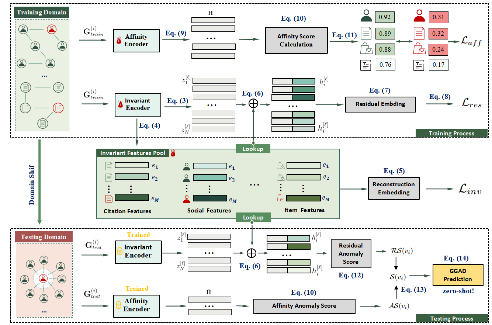

# IA-GGAD: Zero-shot Generalist Graph Anomaly Detection via Invariant and Affinity Learning

This repository is the source codes implementation of "IA-GGAD: Zero-shot Generalist Graph Anomaly Detection via
Invariant and Affinity Learning"



# running environment

* python 3.8.14
* torch 1.13.1+cu117
* dgl 0.9.1+cu117

# Usage

```
python run_IA_GGAD.py 
```

