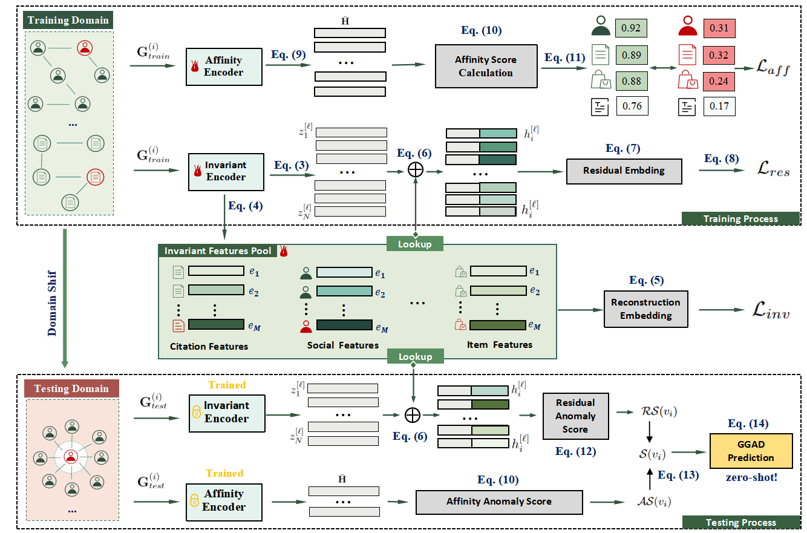

# IA-GGAD: Zero-shot Generalist Graph Anomaly Detection via Invariant and Affinity Learning

This repository is the source code implementation of "IA-GGAD: Zero-shot Generalist Graph Anomaly Detection via
Invariant and Affinity Learning", accepted by NeurIPS 2025 Spotlight.



# running environment

* python 3.8.14
* torch 1.13.1+cu117
* dgl 0.9.1+cu117

# Usage

```
python run_IA_GGAD.py 
```

```js/java/c#/text
@inproceedings{zhang2025iaggad,
  title={IA-GGAD: Zero-shot Generalist Graph Anomaly Detection via Invariant and Affinity Learning},
  author={Zhang, Xiong and He, Zhenli and Fu, Changlong and Xie, Cheng},
  booktitle={Advances in Neural Information Processing Systems},
  year={2025}
}
```
